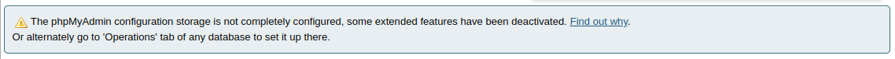
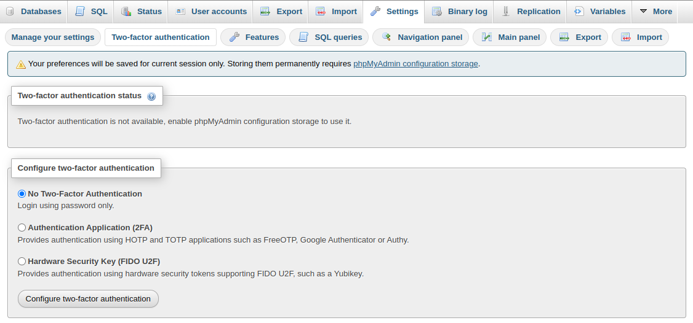
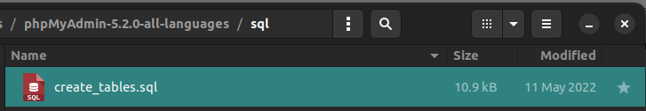
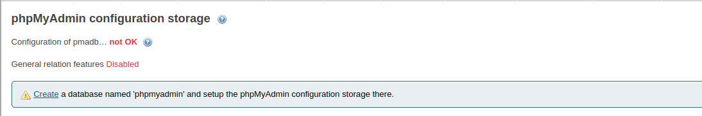
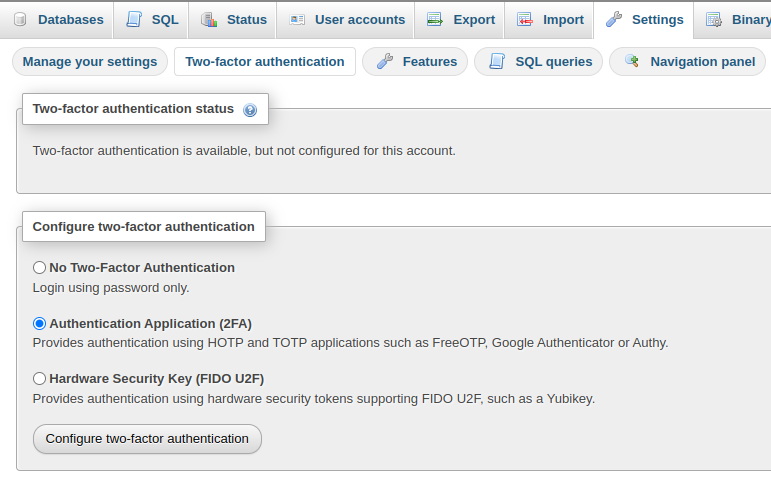
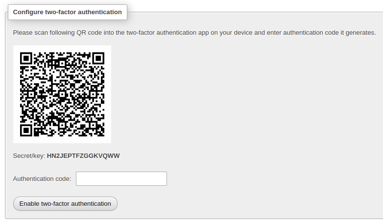
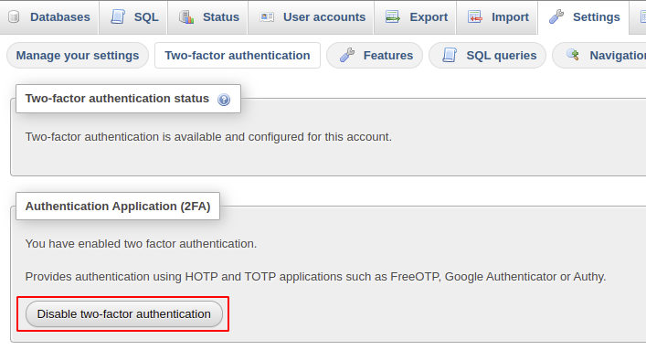

phpMyAdmin 是一個以 PHP 為基礎開發，Web-Base 方式架構在伺服器上圖形化的 MySQL/MariaDB 的資料庫管理工具。

安裝完 phpMyAdmin 登入時，若在首頁下方出現如下圖的提示警告訊息 **The phpMyAdmin configuration storage is not completely configured, some extended features have been deactivated.**



表示缺少「phpmyadmin」資料庫可以用來儲存 phpMyAdmin 的一些額外設定，而啓用兩階段的功能也會需要這個 **phpMyAdmin Configuration Storage** 來儲存個人的 2FA 設定內容。



## 建立 phpMyAdmin Configuration Storage
若要開啓 **phpMyAdmin Configuration Storage** 有兩個已知的方式：
1. 匯入 phpMyAdmin 中的 `create_tables.sql` 建立 `phpmyadmin` 資料庫
2. 在頁面檢測的結果選擇 **Create** 的連結

### 匯入 create_tables 建立資料庫
我們可以在 phpMyAdmin 中的 sql 資料夾（`phpmyadmin/sql/`）下，找到名稱為 `create_tables.sql` 的 SQL 檔，這個 SQL 檔能夠用來建立儲存進階功能設定的 `phpmyadmin` 資料庫。



可以在 command line 用 mysql cli 工具匯入，指令如下：
```shell
$ mysql -u root -p < sql/create_tables.sql
```

也可使用 phpMyAdmin 提供的圖形化界面的匯入功能，將 `create_tables.sql` 檔案匯入。成功的匯入後就能看到增加了一個 `papmyadmin` 資料庫，其中有許多以 `pma__` 開頭的資料表。


### 頁面檢測的結果的 Create 連結
首頁下方警告訊息 「The phpMyAdmin configuration storage ...略... deactivated」 緊接着一個 **Find out why** 的連結，點擊之後，會轉換到 phpMyAdmin configuration storage 檢查程序頁面，頁面檢查失敗時出現另一個警告訊息 「Create a database named 'phpmyadmin' and setup the phpMyAdmin configuration storage there」，最前方的 **Create** 為一個可以點擊的超連結。這個連結會帶我們到建立 `phpmyadmin` 資料庫的頁面。




## 建立 configuration storage 設定

在資料庫中，我們不會讓所有的使用者都擁有可以完全修改 `phpmyadmin` 資料庫的權限，避免s使用者不小心更動或是刪除別人的資料，所以我們需要新增一個專門給 configuration storage 使用的帳號並賦予權限，專門用來操控這些進階設定儲存用。

### 建立使用者及密碼
使用具有資料庫管理者權限的帳號登入資料庫，建立給 configuration storage 使用的新使用者帳號及密碼，名稱可以自訂。並給予在 `phpmyadmin` 資料庫中有 `SELECT`、`INSERT`、 `UPDATE`、`DELETE` 四個權限。

```sql
MariaDB [(none)]> CREATE USER 'pma'@'localhost' IDENTIFIED BY 'password';
MariaDB [(none)]> GRANT SELECT, INSERT, UPDATE, DELETE ON phpmyadmin.* TO 'pma'@'localhost';
MariaDB [(none)]> FLUSH PRIVILEGES;
```


### 修改 config.inc.php 設定檔
開啟 `config.inc.php` 設定檔，在對應的 `$cfg['Servers'][$i]` 加入如下的設定內容，`controluser` 為前一個步驟設定的帳號名稱，`controlpass` 為前一個步驟設定的密碼。
```php
/**
 * phpMyAdmin configuration storage settings.
 */

/* User used to manipulate with storage */
$cfg['Servers'][$i]['controluser'] = 'pma';
$cfg['Servers'][$i]['controlpass'] = 'pmapass';

/* Storage database and tables */
$cfg['Servers'][$i]['pmadb'] = 'phpmyadmin';
$cfg['Servers'][$i]['bookmarktable'] = 'pma__bookmark';
$cfg['Servers'][$i]['relation'] = 'pma__relation';
$cfg['Servers'][$i]['table_info'] = 'pma__table_info';
$cfg['Servers'][$i]['table_coords'] = 'pma__table_coords';
$cfg['Servers'][$i]['pdf_pages'] = 'pma__pdf_pages';
$cfg['Servers'][$i]['column_info'] = 'pma__column_info';
$cfg['Servers'][$i]['history'] = 'pma__history';
$cfg['Servers'][$i]['table_uiprefs'] = 'pma__table_uiprefs';
$cfg['Servers'][$i]['tracking'] = 'pma__tracking';
$cfg['Servers'][$i]['userconfig'] = 'pma__userconfig';
$cfg['Servers'][$i]['recent'] = 'pma__recent';
$cfg['Servers'][$i]['favorite'] = 'pma__favorite';
$cfg['Servers'][$i]['users'] = 'pma__users';
$cfg['Servers'][$i]['usergroups'] = 'pma__usergroups';
$cfg['Servers'][$i]['navigationhiding'] = 'pma__navigationhiding';
$cfg['Servers'][$i]['savedsearches'] = 'pma__savedsearches';
$cfg['Servers'][$i]['central_columns'] = 'pma__central_columns';
$cfg['Servers'][$i]['designer_settings'] = 'pma__designer_settings';
$cfg['Servers'][$i]['export_templates'] = 'pma__export_templates';
```

## 開啓兩階段認證
再回到 phpMyAdmin 的頁面，**Setting** -> **Two-factor authentication**，在 **Configure Two-factor authentication** 區塊中選擇 **Authentication Application (2FA)**，再按下 **Configure two-factor authentication** 按鈕。



接著會出現一個 QRCode 的畫面，打開行動設備中的 Google Authenticator 軟體（或是 Authy）軟體，掃描頁面上的 QRCode，再將出現的 OTP(One-Time Password) 填入 QRCode 下方的輸入格，
最後按下 **Enable two-factor authentication** 就完成整個步驟。



## 關閉兩階段驗證
如果要關閉兩階段驗證，同樣回到 **Setting** -> **Two-factor authentication**，按下 **Disable two-factor authentication** 即可。



參考資料：
1. [phpMyAdmin兩步驟驗證 | 易普印 e知識百科](https://blog.eprint.com.tw/phpmyadmin-with-two-factor-authentication/)
2. [phpMyAdmin 啟用2FA - linux | 丁丁的亂寫空間](https://blog.kawai.moe/linux/phpmyadmin-%E5%95%9F%E7%94%A82fa/)
4. [phpMyAdmin 双因素身份验证配置 - VPSdada](https://www.vpsdada.com/tools/phpmyadmin-two-factor-authentication/)
