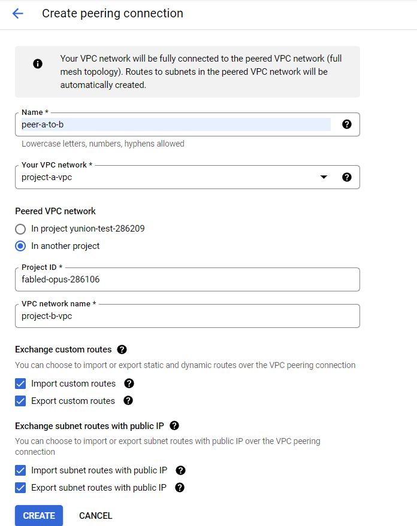
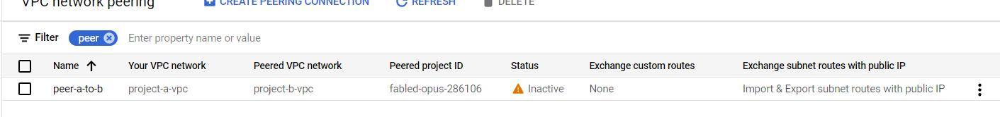
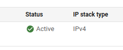

在 Google Cloud Platform 中，如果要將兩個不同的 project 或是不同 organization 的 Private Network 相連，可以透過 VPC network peering 的方式來達成，讓一些服務可以在 Private 下互通，降低使用外網的風險來增加安全性。

VPC network peering 有幾項需要注意的部分：
1. 一個 Network 最多只能有 25 個 peering Networks
2. 一個 Network 和 peered Networks 最多能有 15,500 個 instance。
3. Peered Networks 間的 subnet IP range 不能重疊，如果一個有 `10.1.0.0/16`，另一個就一定不能重複。
4. 只支援 VPC Network Peering 不支援 legacy networks
5. 不能透過 peered networks 連線至 VPN

## 1. 建立 Peering 設定
在建立之前，先將要 peering 的兩個 Project 建立好 VPC 網路及其 subnet。會在兩個專案中建立 peering 相互連結只對方。

開啟 Google Cloud console，選擇（或搜尋）VPC network 點選其中的 **VPC network peering**。

1. 在列表上方點擊 **CREATE PEERING CONNECTION** 開始
2. 看到簡短說明和提示後點擊 **CONTINUE** 繼續
3. 輸入這個 connection 要什麼名稱
4. 選擇在專案中要作為 peering 的 VPC
5. 因為我們要和另一個專案 Peer，點選 **In another project**
6. 填入另一個 **Project ID**，注意不是填入 Project Name
7. 輸入另一個專案下要連結的 VPC network 名稱
8. 最後按下 **CREATE** 建立

建立後，在另一個專案完成設定前，Status 會顯示為 inactive 狀態。

## 2. 對等建立 Peering 設定
同樣的步驟，在另一個專案中也完成建立對等的 VPC network peering connection。當要連線的兩個專案都建立好到對方的連線後，在彼此 connection 列表中的狀態就會顯示為 **Active** 了！

## 3. 測試連線
完成前述建立 VPC networking peering 的步驟之後，就可以在兩邊的 GCE 中進行測試。作為測試的這兩台 GCE，網路部分要是已經建立連結的 VPC subnet，SSH 連結進入 GCE 中，在 Terminal 中以 `ping` 指令相互測試對方的 **Internal IP**，如果可以看到 ping 的回應就表示兩邊的 VPC network peering 建立已經成功。

## 後記
原本希望在建立 VPC neetwork peering 之後，可以讓 Project B 的 GCE 能夠連結 Project A 中的 CloudSQL，Project A 中的 CloudSQL 設定僅能 private 才可以連線。

實際測試在 Project B 中的 GCE 一樣是無法連上 CloudSQL，查詢了一下可能的原因，當 CloudSQL 建立的時候，在 GCP 上實際是建立了一個專案用 VPC network peering 的方式連結過去，當 Project A <-----> Project B，Project B <-----> Project C 都建立好 peering connection 時，Project A <--x--> Project C 這兩個專案是沒有直接連結的。

所以我們無法讓 Project B 直接連結到 CloudSQL，因為建立 peering 是兩個專案都要設定才行，根據這篇 [How can I access the Cloud SQL with private IP only from another Project/VPC? | C2C Community](https://community.c2cglobal.com/infrastructure-122/how-can-i-access-the-cloud-sql-with-private-ip-only-from-another-project-vpc-953) 內容說明，如果要這麼做只能請 Google Cloud Platform  那邊幫忙設定了。另一個方式，則是使用 Shared VPC 的方式來實現了。

---
參考資料：
1. [VPC Network Peering | Google Cloud](https://cloud.google.com/vpc/docs/vpc-peering)
2. [[手把手教學] VPC Network peering 基本介紹 - iKala Cloud](https://ikala.cloud/vpc-network-peering/)
3. [iT 邦幫忙::一起幫忙解決難題，拯救 IT 人的一天](https://ithelp.ithome.com.tw/m/articles/10265026)
