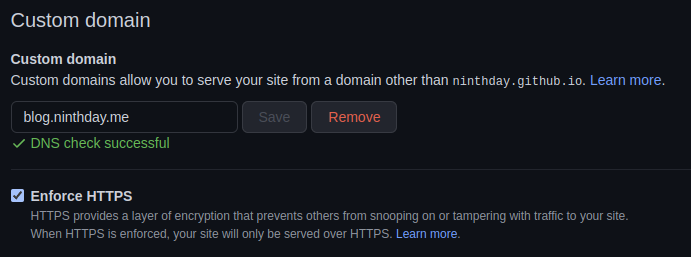

當我們將靜態網頁的內容上傳至 GitHub Page 後，我們可以使用 `https://your-username.github.io` 瀏覽上傳的內容，但如果想更具自己代表性，我們可以更換使用自己所購買網域的網址。

## 1. 購買網域
在使用自己名稱的網址前，要先有屬於自己的域名，選擇自己習慣的網域代理商（我選擇的是 [Gandi](https://www.gandi.net)）。獲得自己的網域名稱後，在域名的列表中可以看到目前擁有的域名有哪些。

## 2. 設定 DNS Record
因為 Gandi 本身有提供 DNS Server 的服務，我們只需要在 Gandi 網站裡做好 Record 設定就可以使用，不用再自己架設 DNS 伺服器，蠻方便的。

在域名列表中，選擇點選要成為 GitHub Page 使用的域名，進入後選擇「DNS 記錄」項目，在這裡我們可以新增和修改 DNS Record。DNS Record 有許多不同的類型，這次我們會使用的主要有 **A Record** 及 **CNAME  Record**。
-   **A Record** : A 代表的是 Address ，是紀錄 IP Address 與網域名稱的對應的記錄，A 記錄會將網域名稱指向一組 IP。
-   **CNAME  Record** ： CNAME 是網域名稱的別名，用來將子域名指向另外一個主機的域名，最常見的就是將 www.abc.com（子域名）指向 abd.com（購買的主域名） ，避免使用者找不到網站。

### 2.1 取得 GitHub IP
為了讓 GitHub Page 能夠支援使用 HTTPS 設定，依據[官方文件](https://docs.github.com/en/github/working-with-github-pages/managing-a-custom-domain-for-your-github-pages-site#configuring-a-records-with-your-dns-provider)，需要在 DNS Record 中將 base domain 加入 GitHub 的 IP，我們可以使用 `dig` 或是 `host` 的方式查詢：
```shell
$ dig ninthday.github.io +nostats +nocomments +nocmd
;ninthday.github.io.		IN	A
ninthday.github.io.	3525	IN	A	185.199.111.153
ninthday.github.io.	3525	IN	A	185.199.109.153
ninthday.github.io.	3525	IN	A	185.199.108.153
ninthday.github.io.	3525	IN	A	185.199.110.153
```

### 2.2 新增 A Record
新增 **A** 類型的 Record，將 `@` 名稱設定至前一個步驟查詢到的 IP，如下


DNS 設定之後會需要等待一段時間才會生效，可以再用 `dig` 指令查詢，出現下面的結果就是已經生效了。
```shell
$ dig ninthday.me +nostats +nocomments +nocmd
ninthday.me.		10800	IN	A	185.199.110.153
ninthday.me.		10800	IN	A	185.199.108.153
ninthday.me.		10800	IN	A	185.199.111.153
ninthday.me.		10800	IN	A	185.199.109.153
```

### 2.3 新增 CNAME  Record
新增 **CNAME** 類型的 Record，我希望將 `blog.ninthday.me` 對應至 GitHub Page，因此設定的時候將名稱為 `blog` 設定至 `ninthday.hithub.io`。


## 3.  GitHub Repo 設定
最後至 Github Pages 的 Repo 中設定 Custom domain（ `Settings` -> `Pages` ），`Save` 之後 GitHub 會進行 DNS 的檢查，檢查成功後 GitHub 會在這個 Repo 下建立一個 CNAME 檔案，檔案的內容就是我們設定的 domain name 網址。



> Note: 設定時，將下方 `Enforce HTTPS` 勾選起來，GitHub 就會幫忙處理使用自己網址時的 HTTPS 憑證內容

之後當我們再瀏覽這個 Github Pages 時，網址顯示的就會是我們自定的網址，而不是 Github Pages 提供的 github.io 網址。

---

參考資料：
1. [Managing a custom domain for your GitHub Pages site - GitHub Docs](https://docs.github.com/en/pages/configuring-a-custom-domain-for-your-github-pages-site/managing-a-custom-domain-for-your-github-pages-site)
