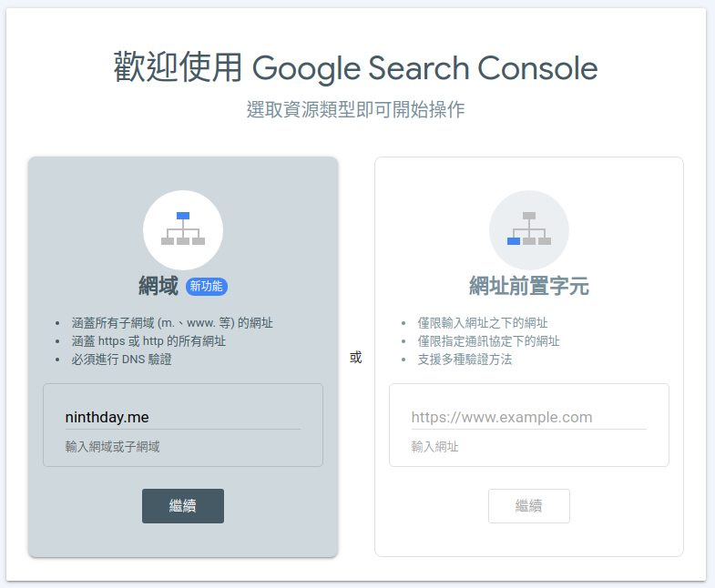
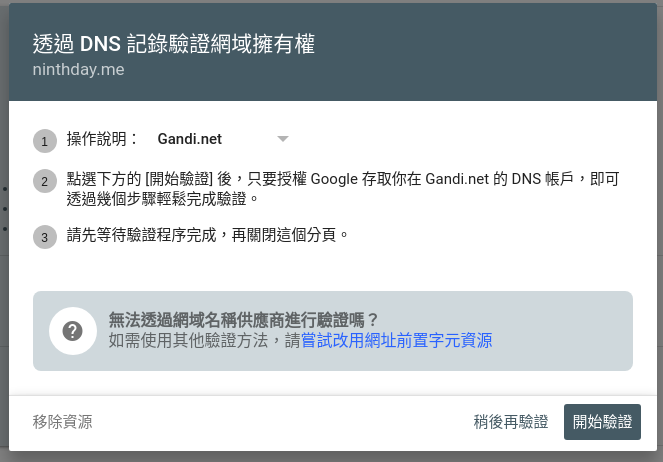
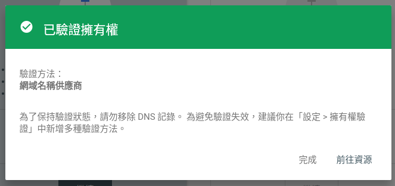
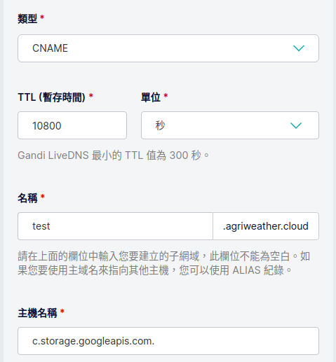
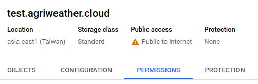
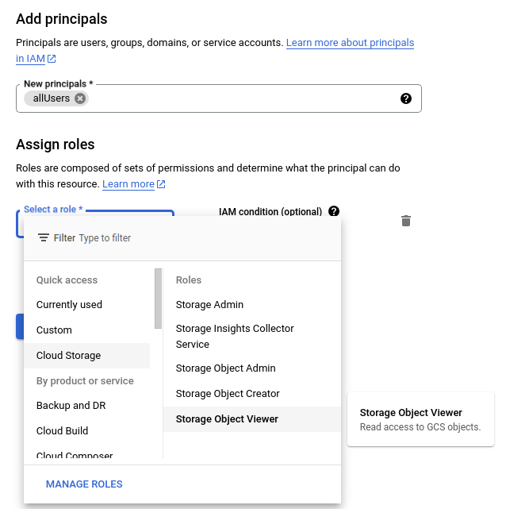
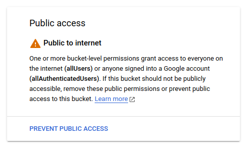
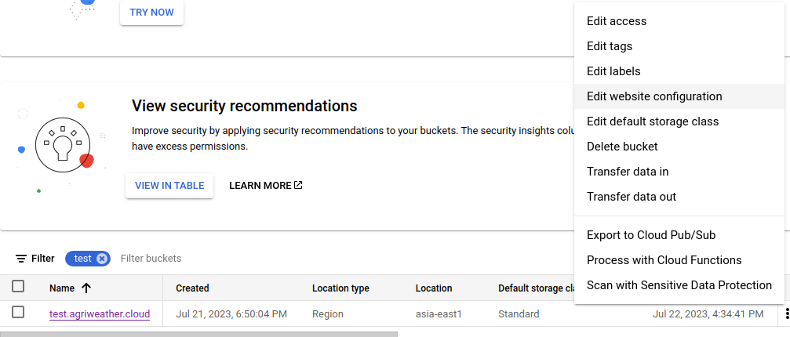
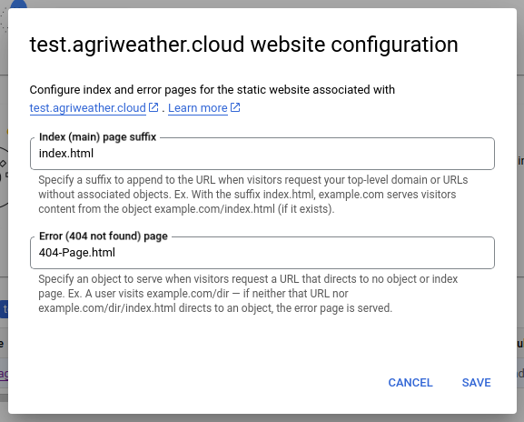
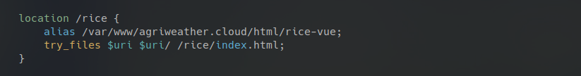

在開始閱讀內文前，假設我們已經在 Google Cloud platform 完成建立可以使用的 Project。

## 設定 Google Search Console

首先，Google 會先確認我們對要設定的網域，具備擁有或是管理權限。如果是在 Google Domains 購買的網域名稱，Google 會自動完成驗證。如果是在其他網域代理商購買，就會需要至 [Google Search Console](https://search.google.com/search-console/) 進行網域的驗證。



如果擁有網域，可以直接選擇左邊的網域，這個部分會需要對 DNS 進行驗證。跟着步驟進行，我剛好是透過 Gandi.net 購買網域，在這裡就可以直接點選下面的開始驗證程序。



驗證程序將會導引至 Gandi 網站，輸入 Gandi 的帳號密碼後，就會自動進行網域擁有選的驗證，完成驗證後就可以獲得驗證成功的畫面。



參考內容：
[Domain-named bucket verification  |  Cloud Storage  |  Google Cloud](https://cloud.google.com/storage/docs/domain-name-verification#verification)

## 建立 CNAME record 對應

在網路上，網址都是代表一個位置，DNS 會解析網址成為我們要去的目標。由於 GCS（Google Cloud Storage） 的位址為 Google 所擁有，要使用我們自己定義的網址來當作 GCS 的位址，我們需要在 DNS 建立一個別名指向 GCS。

以 `test.agriweather.cloud` 作為例子：
- 類型：**CNAME**
- 名稱：**test.agriweather.cloud**
- 主機名稱：**c.storage.googleapis.com.**

>Note:
>主機名稱最後要加上一個點，才不會加上自己的網域名稱變成 `c.storage.googleapis.com.agriweather.cloud`。



## 建立 Cloud Storage Bucket

在這個步驟中，我們要建立一個 Bucket 來放置網頁的內容。由 Google Cloud Console 中找到 **Cloud Storage** 項目，點擊上方 **CREATE** 來建立一個新的 Bucket。

完成建立的幾個步驟內容
1. **Name your bucket**：這個 Bucket 的名稱，請使用前述步驟中，預計要使用的 domain name 來命名，如 test.agriweather.cloud。
2. **Choose where to store your data**：選擇存放的地方，有 `Multi-region`、`Dual-region`、`Region`，存放在越多位置有可能離你的使用者越近，但是價格也會比較高。
3. **Choose a storage class for your data**：選擇 Storage 的類別，選擇 **Standard**。
4. **Choose how to control access to objects**：控制訪問的權限，把預設 Enforce public access prevention on this bucket 的勾選移除，Access control 部分我選擇 **Uniform** 整個資料夾都統一權限。
5. **Choose how to protect object data**：最後這個項目使用預設設定 None。

## 設定 Public 權限

使用 GCS 來作為靜態網站的位置，要讓所有人都可以訪問 Bucket 中的內容，預設是無法存取內容，所以我們要設定 Bucket-level 的訪問權限至 Public access。

1. 點選至上個步驟建立的 Bucket（使用 Domain Name 作為名稱的 Bucket），進到 Bucket detail 的畫面。
2. 選擇 **Permissions** 標籤。
    
3. 點擊 GRANT ACCESS 按鈕，在 New principals 中輸入 **allUsers**，並在 Role 角色的部分找到 **Cloud Storage** > **Storage Object Viewer**
    
4. 完成設定後，**Permissions** 標籤頁面中就會出現如下的畫面
    

## 編輯 WebSite Configration

進入最後一個步驟，設定進入的索引頁（index Page）和自定義的錯誤資訊頁（Error Page）。索引頁是由 `MainPageSuffix` 屬性控制，錯誤頁則是由 `NotFoundPage` 屬性控制。

設定 WebSite Configration 屬性的方法，在 Bucket 列表的最後面有三個點，點擊後的清單中有個 **Edit website configration** 的項目。


這個項目會有個設定的對話視窗，已經預設在 Index (main) page suffix 填上 index.html， Error (404 not found) page 填上 404-Page.html。如果在網站上有對應的檔案則可以不用修改。


也可以使用 gsutil 指令的方式設定。
```shell
$ gsutil web set -m index.html -e 404-Page.html gs://test.agriweather.cloud
```

如果使用 Vue.js 這類的前端框架，平時我們在 `nginx` 的設定如下。


主要是當發生路徑不存在的時候，嘗試使用主目錄下的 index.html 做為程式的進入點，不會直接拋出 404 NotFound。同樣的意思，在 Cloud Storage Bucket 的 website configration 設定中，我們把 **Error (404 not found) page** 的部分，也填上 index.html 索引頁，就能在當路徑不存在的時候，會導引至 index.html。

## 測試網站

現在我們可以打開瀏覽器，在網址列的地方輸入網址 `test.agriweather.cloud`，來確認一下我們網頁的內容是不是都能正常顯示出來了。

> Note:
> 完成後，我們只能使用 `http` 的方式連線。若要使用 `https` 連線，我在另一篇文章中再來說明。

參考資料：
1. [Host a Static Website in Google Cloud with Cloud Storage](https://codelabs.developers.google.com/codelabs/cloud-webapp-hosting-gcs#1)
3. [How To Host a Vue.js Static Website With GCP Cloud Storage | by Bhargav Bachina | Bachina Labs | Medium](https://medium.com/bb-tutorials-and-thoughts/how-to-host-a-vue-js-static-website-with-gcp-cloud-storage-b8e87b89e4de)
4. [Static website examples and tips  |  Cloud Storage  |  Google Cloud](https://cloud.google.com/storage/docs/static-website#examples)
