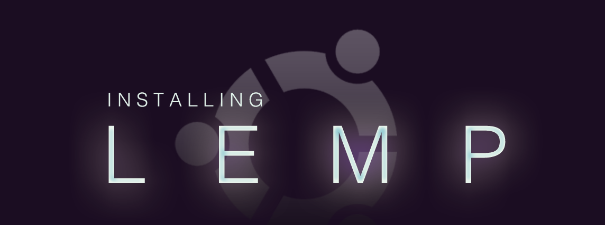

一直以來都是使用 LAMP（Linux + Apache + MySQL + PHP） 架構居多，基於 Apache 是個胖子加上 MySQL 的黑化...，嘗試開始使用 LEMP 的組合。LEMP 為 Linux + Nginx + MariaDB + PHP，後面敘述為在 ubuntu 18.04 中的安裝方式與設定。

<!--more-->

# Nginx 伺服器

## 安裝 Nginx 網頁伺服器
Negix 已經有內建在 ubuntu 套件庫中，可以使用 `apt` 直接安裝，在 command line 輸入下列指令進行安裝：
```bash
$ sudo apt update && sudo apt install nginx

# 確認運行狀態
$ sudo systemctl status nginx
```

## 防火牆設定

開啓 ufw 防火牆設定允許 nginx 服務通過
```bash
$ sudo ufw allow 'Nginx HTTP'

# 如果同時要 HTTP 及 HTTPS 可以使用 'Nginx Full'
$ sudo ufw allow 'Nginx Full'

Rule added
Rule added (v6)

# 啓動 ufw 防火牆
$ sudo ufw enable
```
> 開啓防火牆前，請先確認是不是已經先開啓 SSH 通過，以免把自己鎖在外面。

# 安裝 MariaDB 資料庫

MariaDB 10.2 以上版本與 MySQL 的兼容性優於 10.1，安裝 MariaDB 10.2 以上版本，目前穩定版本為 10.4。

## 安裝 MariaDB

使用 MariaDB Repositories 方式安裝，首先加入 MariaDB 10.4 的官方套件庫資訊

```bash
$ sudo apt-get install software-properties-common
$ sudo apt-key adv --recv-keys --keyserver hkp://keyserver.ubuntu.com:80 0xF1656F24C74CD1D8
$ sudo add-apt-repository 'deb [arch=amd64,arm64,ppc64el] http://ftp.ubuntu-tw.org/mirror/mariadb/repo/10.4/ubuntu bionic main'
```

更新套件庫資訊後直接安裝 MariaDB
```bash
$ sudo apt update
$ sudo apt install mariadb-server
```
## 修改預設路徑
如果不想把 var 塞爆，或是希望有獨立的分區來存儲，可以透過修改 Mariadb 預設存資料檔放路徑來達到。（選擇性）

```bash
# 停止 mariadb service
$ sudo systemctl stop mariadb
# 建立新的存放目錄位置（如：`/db/mariadb`）
$ sudo mkdir /db/mariadb
# 修改資料夾權限
$ sudo chown mysql.mysql /db/mariadb
# 複製目前目錄下的內容至新的存放目錄位置
$ sudo cp -rp /var/lib/mysql/* /db/mariadb

# 修改 mariadb 設定檔
$ sudo vim /etc/mysql/mariadb.conf.d/50-server.cnf
... 略 ...
# 找到 datadir 位置
datadir     = /db/mariadb
... 略 ...


# 重新啓動 mariadb
$ sudo systemctl start mariadb
```

預設 mariadb 僅接受本機連線，如果需要由其他伺服器連線，需要修改 `mariadb.conf.d/50-server.cnf` 中的 bind-address 項目

```text
# bind-address        = 127.0.0.1
bind-address        = 0.0.0.0
```

參考資料：[Setting up MariaDB Repositories](https://downloads.mariadb.org/mariadb/repositories/#mirror=ossplanet&distro=Ubuntu&distro_release=bionic--ubuntu_bionic&version=10.4)

# 安裝 PHP 及設定 Nginx 支援 PHP

Nginx 不包含原生的 PHP 處理，所以我們必須安裝 PHP-FPM (FastCGI Process Manager)。同時也安裝 php-mysql 使 PHP 能與 MariaDB 溝通。
```bash
# 下述的安裝為 Laravel 會使用到的套件
$ sudo apt install php7.2 php7.2-fpm php7.2-cli php7.2-mbstring php7.2-curl php7.2-mysql php7.2-xml php7.2-zip php7.2-gmp

# 安裝完畢確認 PHP 版本
$ php --version
```

Nginx 透過 PHP 的 Socket 溝通，安裝 PHP 後確認 scoket 的執行情形。並記住 `php7.x-fpm.sock`
> 在 nginx 設定中會使用 php7.x-fpm.sock
```bash
$ ls /var/run/php/

php7.2-fpm.pid php7.2-fpm.sock
``` 

修改 Nginx 設定檔，預設的網站設定檔位置在 `/etc/nginx/sites-available/default`
```bash
$ sudo vim /etc/nginx/sites-available/default
```

找到 index 位置，在識別副檔名的部分加入 `index.php`，以預設支援 php 的 index 頁面。
```nginx
# Add index.php to the list if you are using PHP
index index.php index.html index.htm index.nginx-debian.html;
```

找到設定 php 區塊，移除部分註解符號 `#` ，將前面 socket 的位置及名稱換上。`/var/run/php/php7.2-fpm.sock`
```nginx
...
        location ~ \.php$ {
                include snippets/fastcgi-php.conf;
        #
        #       # With php-fpm (or other unix sockets):
                fastcgi_pass unix:/var/run/php/php7.2-fpm.sock;
        #       # With php-cgi (or other tcp sockets):
        #       fastcgi_pass 127.0.0.1:9000;
        }
...
```
用下面的指令先檢查 nginx 設定的語法有沒有錯誤。
```bash
$ sudo nginx -t

nginx: the configuration file /etc/nginx/nginx.conf syntax is ok
nginx: configuration file /etc/nginx/nginx.conf test is successful
```

重新 reload nginx
```bash
$ sudo systemctl reload nginx
```

## 測試 PHP
在預設路徑 `/var/www/html` 下建立一個 `info.php` 檔案加入 phpinfo 語法
```bash
$ sudo vim /var/www/html/info.php
```
```php
<?php
phpinfo();
```

連線到 `http://your-domain/info.php`，如果能夠看到相關的 PHP 資訊就是成功了。確認後記得要再刪除 info.php 檔案避免透露過多的資訊在網路上。
```bash
$ sudo rm /var/www/html/info.php
```

## 安裝 Composer
Composer 是 PHP 生態系最廣為使用的相依管理工具。
```bash
php -r "copy('https://getcomposer.org/installer', 'composer-setup.php');"
php -r "if (hash_file('sha384', 'composer-setup.php') === '48e3236262b34d30969dca3c37281b3b4bbe3221bda826ac6a9a62d6444cdb0dcd0615698a5cbe587c3f0fe57a54d8f5') { echo 'Installer verified'; } else { echo 'Installer corrupt'; unlink('composer-setup.php'); } echo PHP_EOL;"
php composer-setup.php
php -r "unlink('composer-setup.php');"
sudo mv composer.phar /usr/local/bin/composer
```
參考：[Download Composer](https://getcomposer.org/download/)
