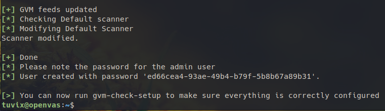

以手動方式安裝 OpenVAS 是一個步驟非常多且繁雜的過程，可以參考這篇文章： [Install GVM 21.04 on Debian 11/Debian 10 - kifarunix.com](https://kifarunix.com/install-gvm-21-04-on-debian-11-debian-10/) 的內容。其中如果還有什麼錯誤，還需要花更多的時間來處理過程中出現的問題。因此手動從頭到尾的安裝就不是想使用的安裝方式。

在網路上有很多安裝 OpenVAS 的教學，都是直接在 Kali Linux 上，可以無痛或少痛的安裝。然而在 GCP 上沒有 Google 官方的 Kali Linux image 可以直接使用，雖然在 Google Cloud MarketPlace 能夠查到直接 `Launch` 使用，但是價格一個月需要 92.80 美金，對個人使用來說價格蠻高的。

因此也有使用者是透過 VirtualBox 安裝後再上傳的方式（[infotechca/kali-on-gcp: How to Upload or Install Kali Linux on Google Cloud](https://github.com/infotechca/kali-on-gcp)），來達到在 GCE 上用 Kali Linux。

上述兩個方式，都是直接在 GCE 上安裝 Kali Linux，接着我們就可以在 Kali Linux 上使用 `apt` 的方式安裝 OpenVAS。

因我只有想使用 OpenVAS 並不需要其他 Kali 所安裝的工具，發現其實 Kali Linux 也是基於 Debian 的分支版本，網路上有些分享的方法[^note2]，是先在 GCP 安裝了 Debian 之後再改造為 Kali。如果是這樣，那就有可能利用類似的方式，將 Kali 加入 source list 中，利用 Kali 的來源使用 `apt` 的方式安裝，達到比較簡易的安裝方式。

[^note2]:[How to install and run Kali-Linux on Google Cloud - YouTube](https://www.youtube.com/watch?v=XRJMA67Beh4)

## 安裝 OpenVAS
### Step 1. 加入 Kali Source 及更新套件清單
將 Kali Network repo 加入 `/etc/apt/source.list`。

Kali 有兩個主要的分支可以選擇：
- kali-rolling：預設分支，比較頻繁的更新
- kali-last-snapshot：可以安心使用的穩定版本

在這裡我選擇 kali-rolling 版本的分支，以下面的語法加入到 source.list 中

```shell
$ echo "deb http://http.kali.org/kali kali-rolling main contrib non-free non-free-firmware" | sudo tee /etc/apt/sources.list
```

加入完成後，更新套件清單

```shell
$ sudo apt update
```

參考資料：
[Kali Network Repositories (/etc/apt/sources.list) | Kali Linux Documentation](https://www.kali.org/docs/general-use/kali-linux-sources-list-repositories/)

### Step 2. 加入金鑰

在上個步驟 apt update 時，過程中會出現簽章無效的錯誤

```shell
$ sudo apt update

Get:1 http://wlglam.fsmg.org.nz/kali kali-rolling InRelease [30.5 kB]
Err:1 http://wlglam.fsmg.org.nz/kali kali-rolling InRelease
The following signatures were invalid: EXPKEYSIG ED444FF07D8D0BF6 Kali Linux Repository
```

我們必須要加入金鑰才能更新 Kali 套件清單，加入的方法如下

```shell
$ sudo gpg --keyserver keys.openpgp.org --recv-key ED444FF07D8D0BF6
$ gpg -a --export ED444FF07D8D0BF6 | sudo apt-key add -
```
> Note:
> 部分網路上的教學的 keyserver 使用 `pgpkeys.mit.edu`，目前已經失效查不到 `ED444FF07D8D0BF6`
> 所以我改用 `keys.openpgp.org` 作為 keyserver

### Step3. 安裝 OpenVAS

完成 Kali Repo 加入 source.list 程序，進行套件更新，接下來只要一個語法就可以進行安裝
```shell
$ sudo apt upgrade
$ sudo apt install openvas
```

## 初始化及啓動程式
### 初始化 GVM

執行下面的指令開始初始化 GVM 的步驟，執行之後因為過程中會包含一些 feed 的更新，會花相當久的時間，會花上 1~2 小時的時間，可以泡個咖啡追個劇再回來。

```shell
$ sudo gvm-setup
```

整個初始化的過程完成後，記得複製步驟最後生成的密碼，在我們第一次登入的時候會用上。



```
[*] User created with password 'ed66cea4-93ae-49b4-b79f-5b8b67a89b31'
```

### 檢查 OpenVAS 及啓動服務

完成安裝的步驟之後，接下來我們使用下列的語法，驗證安裝是否正常。

```shell
$ sudo gvm-check-setup
```

使用下面指令，啓動 OpenVAS 服務。執行之後會 listen 在 `9392` Port。

```shell
$ sudo gvm-start
```


## Forward Proxy Server

如果是在本機上安裝，只要開啓瀏覽器並在網址列中輸入 `http://localhost:9392` 就可以連結上 OpenVAS 的 Web GUI，看到登入畫面。由於我們是安裝在 Google Compute Engine 上，沒有辦法使用只允許本機的服務。這時候我們可以使用代理伺服器（Proxy Server）的方式，幫我們將外部的 Http Requeat 橋接至本機指定 Port 的服務上。

### 安裝 Nginx

在 Debian 上安裝 Nginx Web Server 方法很簡單，直接通過官方的套件庫安裝即可。

```shell
$ sudo apt install nginx
```

### 設定 Nginx Proxy 

修改 Nginx Web Server 設定
```shell
$ sudo vim /etc/nginx/sites-available/default
```

在 location 中加入 `proxy_pass` 代理伺服器將封包轉向本機的 `port 9392`。

```conf
server {
    ... 略 ...
    
    location / {
        proxy_pass http://127.0.0.1:9392;
        proxy_set_header Host $host;
    }
}
```

重新 reload nginx 讀取設定的內容。

```bash
$ sudo systemctl reload nginx
```

### 設定 https

完成 Nginx Proxy 轉送的設定後，在網址列輸入 http 位址就會出現 OpenVAS 的登入畫面。然而在輸入帳號密碼之後，系統阻擋了非 https 的登入方式，提示訊息顯示不是  https 登入你的資訊有可能會被攔截。

這時候我們就可以利用 [Certbot](https://certbot.eff.org/) 來取得憑證及完成 Https 設定。細節在此就不再多做敘述，跟着 Certbot 的說明安裝即可，也是一個指令安裝，一個指令就可以設定完成。

## 平時維護

### 重設 admin 密碼

如果忘記 admin 登入的帳號密碼，可以利用下面的指令重新設定密碼。

```shell
$ sudo gvmd --user=admin --new-password=passwd
```


### 更新 Feed

下面的指令能夠更新 feed 的內容。

```shell
$ sudo gvm-feed-update
```


參考資料：
1. [Install GVM 21.04 on Debian 11/Debian 10 - kifarunix.com](https://kifarunix.com/install-gvm-21-04-on-debian-11-debian-10/)
2. [How to install and run Kali-Linux on Google Cloud - YouTube](https://www.youtube.com/watch?v=XRJMA67Beh4)
3. [m0ns7er/GCP: Kali linux on GCP](https://github.com/m0ns7er/GCP)
4. [Complete Beginner OpenVAS Vulnerability Scanning Tutorial - Cyber Security - YouTube](https://www.youtube.com/watch?v=LGh2SetiKaY)
