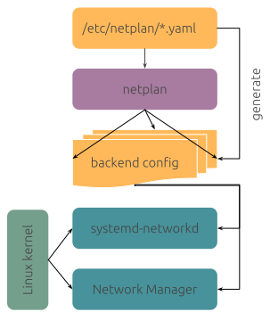

## 什麼是 Netplan

自 Ubuntu 17.10 開始網路的設定就改為使用 netplan 工具作為前端設定工具，我們只需要撰寫少量的設定內容，就可以讓 netplan 生成後端的網路設定文件，無論後端是使用 NetworkManager 或是 Systemd-networkd。

## Netplan 設定



netplan 的設定是使用 YAML 格式撰寫，設定檔在 `/etc/netplan` 路徑下，新安裝時如果有設定 IP 應該會出現如 `/etc/netplan/00-installer-config.yaml` 的設定檔。若完全沒有任何設定檔，可以使用以下指令自動產生預設的設定檔：

```shell
# 產生網路介面設定檔
$ sudo netplan generate
```

編輯設定檔文件 `sudo vim /etc/netplan/00-installer-config.yaml`

```yaml:00-installer-config.yaml
network:
  version: 2
  renderer: networkd
  ethernets:
    enp0s31f6: # 系統網路卡名稱
      addresses: [192.168.0.10/24] # 固定 IP 位址
      gateway4: 192.168.0.1 # 閘道器設定
      nameservers:
        addresses: [1.1.1.1,8.8.8.8] #DNS伺服器位址
```


執行 `netplan try` 測試並套用網路設定檔

```shell
# 測試並套用網路設定檔
$ sudo netplan try
```

> Note:
> 執行指令之後如果設定檔語法沒問題，就會套用新的設定並進行確認，如果 **在 120 秒內沒有確認**，就會自動恢復成原來的網路設定，這樣的設計主要是避免在遠端更改設定時，不小心把自己檔在外面。

使用 `netplan apply` 命令讓網路進行生效。

```shell
# 套用網路介面設定檔
$ sudo netplan apply
```
## gateway4 名稱更換

若出現如下的警告訊息，先別緊張。

```
** (generate:1319): WARNING **: 09:05:28.876: `gateway4` has been deprecated, use default routes instead.
See the 'Default routes' section of the documentation for more details.
```

這段警告主要原因是在 Ubuntu Server 22.04 中，原來的 `gateway4` 項目即將要失效，即使出現上述警告仍能正常的使用網路，未來將更改為 `routes` 名稱，建議還是修改設定為新的名稱內容。

```yaml
network:
  version: 2
  renderer: networkd
  ethernets:
    enp0s31f6:
      addresses:
	    - 192.168.0.10/24
      routes:
      - to: default
        via: 192.168.0.1
      nameservers:
        addresses: [1.1.1.1,8.8.8.8]
```

## 檢查設定結果

執行以下指令查看網路的 ip 位址，
```shell
$ ip address show enp0s31f6
```

要查看預設的路由，可以執行
```shell
$ ip route show
default via 192.168.0.1 dev enp0s31f6 proto dhcp metric 100 
169.254.0.0/16 dev enp0s31f6 scope link metric 1000 
192.168.0.0/24 dev enp0s31f6 proto kernel scope link src 192.168.0.51 metric 100 
```

參考資料：
1. [Canonical Netplan](https://netplan.io/examples)
